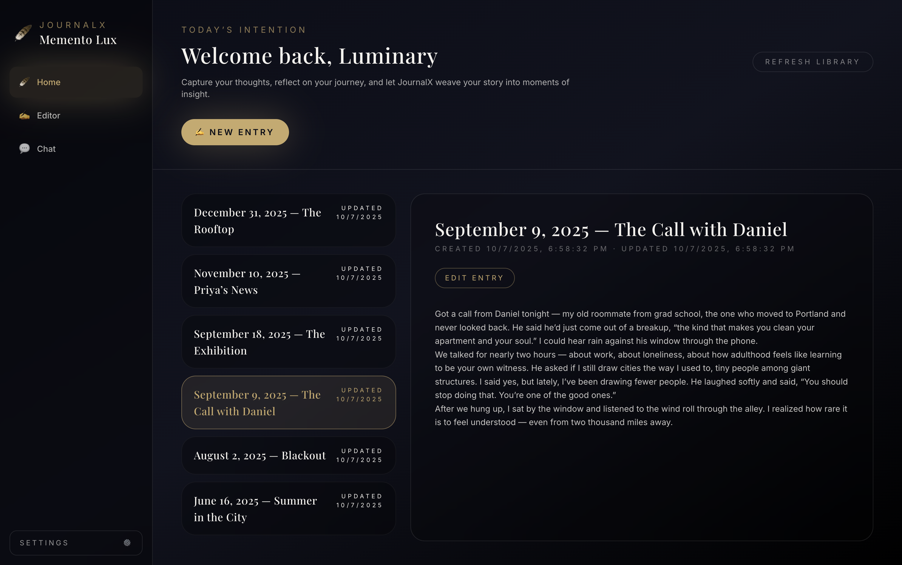
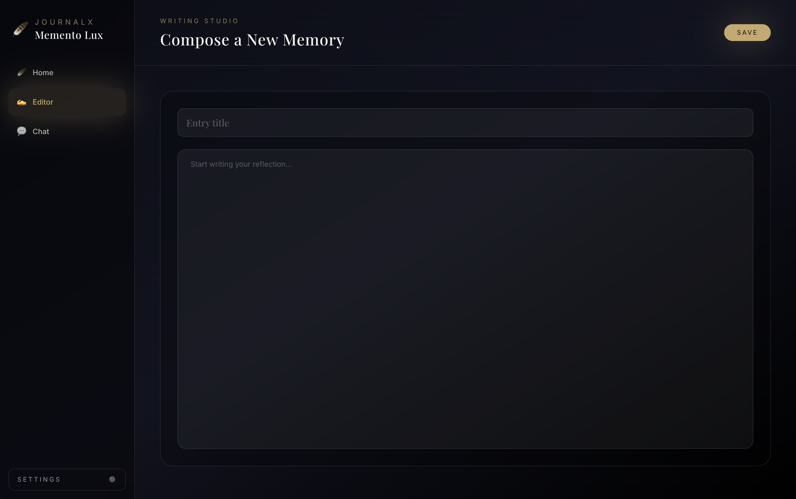
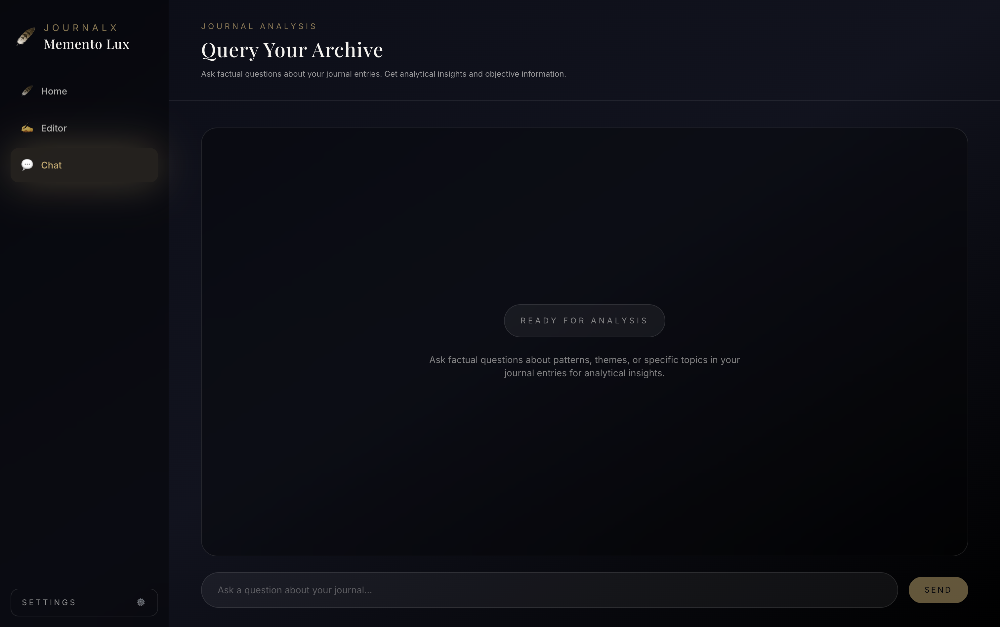

# Pensieve

Pensieve is a local-first, AI-augmented journaling desktop app built with **Electron**, **Vite**, and **React**.
It helps you capture daily reflections, organize them into a personal knowledge base, and explore them with a thoughtful AI journal assistant.

---

## Screenshots





---

## Features

- **Local-first journaling**
  - Entries are stored locally (backed by SQLite / file-based storage).
  - Fast loading of your journal archive without round-trips to a server.

- **Rich journal home view**
  - Browse a **library of entries** with titles, summaries, tags, and last-updated timestamps.
  - Sorts entries by creation date so your latest reflections are always at the top.
  - Quick preview panel with **Markdown rendering** to read entries without leaving the home screen.

- **Focused writing experience**
  - Dedicated **Editor** screen for creating and refining entries.
  - Full **Markdown support** — write with headings, bold, lists, links, and more.
  - Toggleable **live preview** panel for side-by-side editing and rendered output.
  - Clear saving state feedback (`Saving...` / `Saved` / failure notice).

- **AI-powered journal assistant (via OpenAI)**
  - Configurable model selection: **GPT-5 Nano**, **GPT-5 Mini**, or **GPT-5.4**.
  - Temporally-aware system prompt that understands entry dates and can reason about timelines and trends.
  - Emotionally sensitive — responds with care when entries touch on difficult topics.
  - Pattern recognition across entries: recurring themes, mood shifts, contradictions, and growth.
  - Smart RAG pipeline with paragraph-level chunking and FAISS vector search (`text-embedding-3-small`).
  - Dynamic retrieval depth — broad queries ("summarize my month") automatically fetch more context.
  - Date-range filtering for time-bounded queries ("how was I feeling last week").
  - Entry deduplication across conversation turns for richer follow-ups.
  - Streaming responses in the **Chat** screen with full conversation context.

- **Modern UI/UX**
  - Built with **React 18**, **React Router v7**, and **Tailwind CSS**.
  - The main layout uses `AppLayout` with a persistent navigation sidebar (`Nav`) and routed content.
  - Launches maximized for a full, immersive writing experience.
  - Themed with a dark, gradient-heavy aesthetic (midnight / onyx / aurum / pearl).

- **Type-safe and modular architecture**
  - Shared **types** (`journal`, `settings`, `ai`, etc.) under `src/shared/types`.
  - **Stores & context** for app data in `src/shared/context` and `src/shared/store`.
  - **Services** for journal persistence and AI integration in `src/shared/services`.
  - **Hooks** for IPC and app data (`useIpcInvoke`, `useIpcEvent`, `useAppData`).

---

## Tech Stack

- **Frontend / Renderer**
  - React + React DOM
  - React Router (v7)
  - Vite for dev server and bundling
  - Tailwind CSS for styling
  - Zustand for state management
  - sonner for toast notifications

- **Desktop / Packaging**
  - Electron for the desktop runtime
  - electron-builder for packaging and distribution

- **Data / AI**
  - better-sqlite3 for fast local database access
  - OpenAI SDK for chat completions and embeddings
  - faiss-node for vector search over journal entries (paragraph-level chunking)

- **Tooling**
  - TypeScript
  - ESLint (`@typescript-eslint`, React hooks plugin)
  - PostCSS / Autoprefixer

---

## Project Structure

High-level overview:

```text
src/
  App.tsx                 # Root layout with Nav + routed content
  main.tsx                # Vite/React entry point
  routes.tsx              # React Router configuration

  components/
    layout/
      Nav.tsx             # Sidebar navigation

  screens/
    HomePage.tsx          # Library + preview of journal entries
    EditorPage.tsx        # Create/edit a journal entry
    ChatPage.tsx          # Converse with AI about your notes
    SettingsPage.tsx      # App / AI / storage settings
    JournalEntryPage.tsx  # Dedicated read view for a single entry

  shared/
    context/
      AppDataContext.ts   # App data context type definitions
      AppDataProvider.tsx # Provider wiring storage + state
    hooks/
      useAppData.ts       # Access to app-level journal data
      useIpcInvoke.ts     # IPC wrapper for invoking Electron main
      useIpcEvent.ts      # IPC wrapper for event subscriptions
    services/
      JournalService.ts   # CRUD operations for journal entries
      AIService.ts        # AI journal assistant (RAG, streaming, prompts)
    storage/
      FileStorage.ts      # File-based storage abstraction
      SecureStore.ts      # Secure/local storage
      SettingsStorage.ts  # Persistence for app settings
      VectorStore.ts      # Faiss-based vector index with paragraph chunking
      InMemoryStore.ts    # In-memory store implementation
      constants.ts        # Storage constants / paths
    store/
      chatStore.ts        # Zustand store for chat state
    types/
      journal.ts          # Journal entry types
      renderer.ts         # Renderer-side types
      settings.ts         # Settings types
      ai.ts               # AI-related types
      events.ts           # IPC event payloads
      context.ts          # App context shapes

screenshots/
  home.png
  editor.png
  chat.png
```

---

## Getting Started

### Prerequisites

- Node.js (LTS recommended)
- npm (comes with Node)

### Install dependencies

```bash
npm install
```

### Run in development

```bash
npm run dev
```

This starts the Vite dev server and Electron. You should see the Pensieve window open.

### Build for production

```bash
npm run build          # Auto-detect platform
npm run build:mac      # macOS only (dmg + zip)
npm run build:win      # Windows only (nsis)
npm run build:all      # Both platforms
```

This will:

- Run TypeScript type checking
- Build the renderer bundle with Vite
- Package the Electron app using `electron-builder`

Built artifacts will appear under `release/`.

---

## Usage

- **Create a new entry**
  - From the Home screen, click **New Entry**.
  - Enter a title and your reflection in the editor, then click **Save**.

- **Review past entries**
  - Use the left-hand journal library to select entries.
  - The right-hand pane shows a rich preview with timestamps and tags.
  - Click **Edit Entry** to jump back into the editor.

- **Chat with your journal**
  - Open the **Chat** tab.
  - Ask questions like "What themes show up in my entries this month?" or "How have I been feeling lately?"
  - The AI uses your local entries and vector store to ground its responses, with awareness of dates and emotional context.
  - Broad questions automatically pull more entries for richer analysis.

- **Configure settings**
  - Go to the **Settings** screen to set your OpenAI API key and choose your preferred model.

---

## Roadmap / Ideas

- More powerful tagging and search
- Timeline / calendar views of entries
- Offline / local model support
- Encrypted backups and multi-device sync (optional)
- Mood/sentiment timeline and proactive journaling prompts

---

## License

This project is licensed under the **MIT License**.
